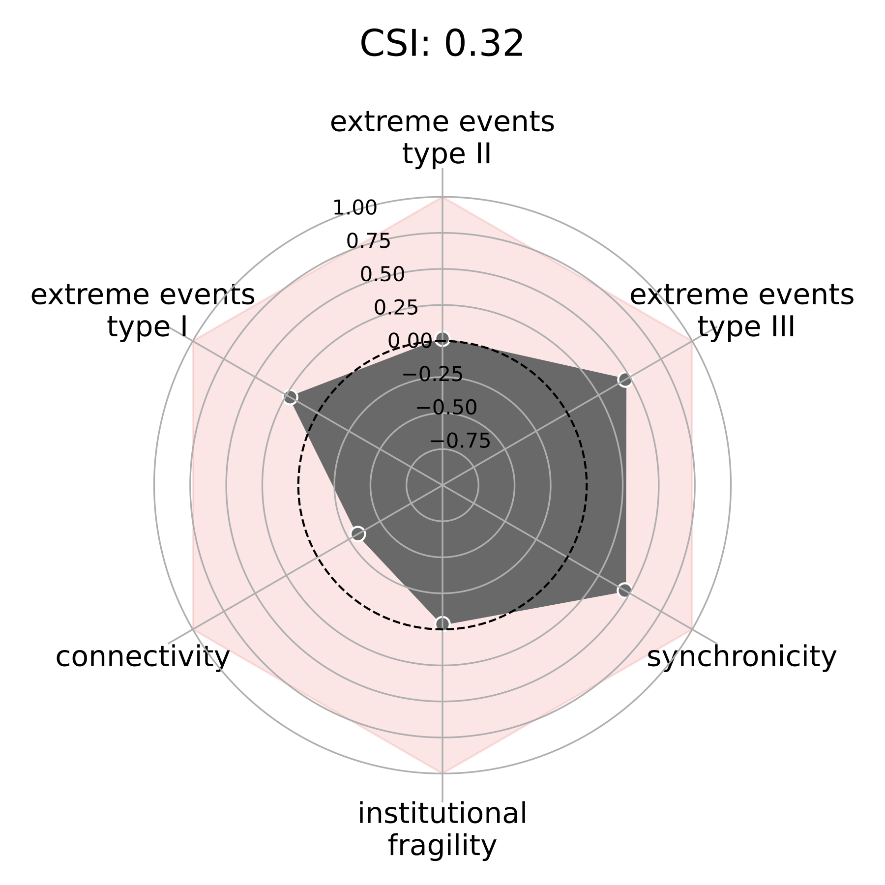

# Climate Security Index (CSI)

Authors: Omar A Guerrero and Daniele Guariso

This is the repository of the Climate Security Index developed by CGIAR and The Alan Turing Institute.
Full details on the CSI theory methodology and methodology can be found in its [Methodological Note](https://github.com/oguerrer/CSI/blob/main/CSI.pdf).
The contents of this repository are organised as follows:

* CSI.pdf: The methodological note of the CSI.
* `code/tutorial.ipynb`: A Jupyter notebook that guides the user through the calculation of the different modules of the CSI, the copmutation of the index, and the creation of a visualisation.
* `code/csi_functions.py`: Contains all the necessary functions to compute the CSI and its different modules. It is loaded by the tutorial.
* `code/example_data/`: an example dataset prepared for the case of Kenya.
* `code/preprocessing_scripts/`: A folder with scripts that the user could use to prepare the data for the CSI, they include imputation, normalisation, reversion, and the estimation of the network of conditional dependencies.

